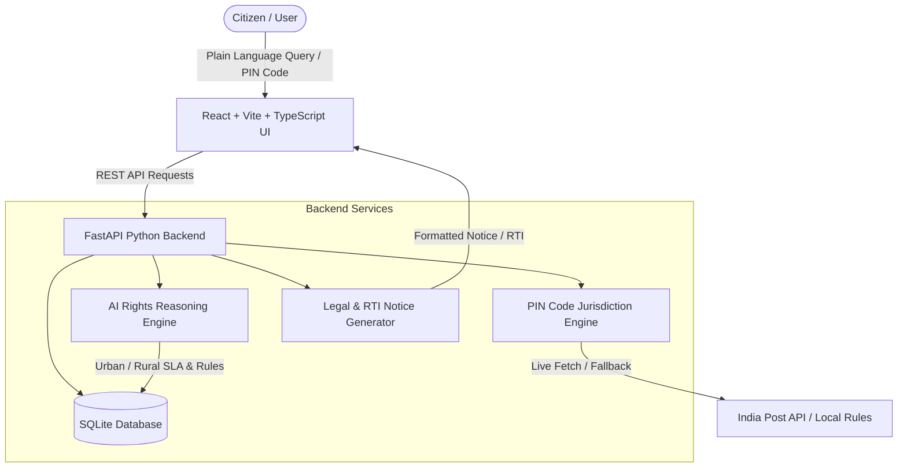

# RightsNavigator AI — OOSC 4.0 Hackathon

> **Team:** Rishabh & Girish  
> **Track:** PS3 — AI for Civic and Legal Empowerment  
> **Submission Deadline:** Phase 1 (Aug 23, 4:00 PM)

---

## 🏛️ Problem Statement

Citizens across India frequently face unaddressed civic grievances and legal infringements — from hazardous potholes, uncollected solid waste, and contaminated drinking water to withheld tenant security deposits and e-commerce consumer fraud. While strong legal protections exist (State Right to Public Services Acts, Consumer Protection Act 2019, Model Tenancy Act 2021, and RTI Act 2005), citizens rarely exercise their rights because navigating complex bureaucratic terminology, jurisdiction boundaries, and formal filing procedures is intimidating and time-consuming.

---

## 🚀 Solution Overview

**RightsNavigator AI** is a conversational AI system designed to empower Indian citizens by translating complex legal and bureaucratic jargon into clear, actionable, location-aware step-by-step guidance.

### Key Capabilities:
1. **Plain-Language AI Diagnosis:** Citizens describe any civic or legal issue in plain language. The AI identifies the governing statutory Act, resolution deadline (SLA), and designated authority.
2. **PIN Code Location Adaptation (Urban vs. Rural):** Automatically detects whether a citizen falls under an **Urban Municipal Corporation** (e.g. BBMP, BMC, NDMC) or a **Rural Gram Panchayat / Block Development Office** via PIN code lookup.
3. **Actionable Step-by-Step Roadmap:** Outlines exactly what to do at each stage of grievance escalation, including exact **DOs** (proof gathering, geotagging) and **DONTs** (avoiding unofficial fees, preserving receipts).
4. **Ready-to-File Legal & RTI Notice Generator:** Generates formatted Section 6(1) Right to Information (RTI) Applications, Consumer Court Notices, Tenant Security Deposit Return Demands, and Municipal Notices.
5. **Grievance Tracker:** Allows citizens to save active cases and track statutory SLA timelines.

---

## 🛠️ Tech Stack

| Layer | Technology |
|---|---|
| **Frontend** | React 18, Vite, TypeScript, Tailwind CSS, Lucide Icons, Canvas-Confetti |
| **Backend** | FastAPI (Python 3.10+), Pydantic v2, Uvicorn |
| **Database** | SQLite 3 (Knowledge Base & Citizen Case Storage) |
| **Location Engine** | Live India Post API + Curated PIN Code Jurisdiction Rules |
| **AI / Logic Engine** | Rule-Based Legal Reasoning Engine + Statutory SLA Engine |

---

## 📐 Architecture



---

## ✨ Features Checklist

- [x] **Conversational Rights Navigator:** AI prompt bar with quick starter templates.
- [x] **PIN Code Jurisdiction Resolver:** Detects District, State, Urban vs. Rural local body, official grievance URL, and helpline numbers.
- [x] **Urban vs Rural Adaptation:** Tailors grievance steps specifically to Municipal Ward Officers (Urban) or Panchayat Secretaries / BDOs (Rural).
- [x] **Statutory SLA & Penalty Engine:** Displays maximum resolution timelines under State Right to Public Services Acts and penalty clauses under Motor Vehicles Act / RTI Act.
- [x] **DOs and DONTs Checklist:** Clear visual cards to prevent common citizen mistakes.
- [x] **Legal & RTI Document Generator:** Live interactive builder for Section 6(1) RTI Applications, Consumer Court Notices, Tenant Notices, and Municipal Complaints.
- [x] **Case Tracker Dashboard:** Save and monitor ongoing grievances.

---

## 📦 Setup Instructions

### 1. Backend Setup (FastAPI)

```bash
# Navigate to backend directory
cd backend

# Create virtual environment
python -m venv venv

# Activate virtual environment
# Windows:
venv\Scripts\activate
# Linux/macOS:
# source venv/bin/activate

# Install dependencies
pip install -r requirements.txt

# Run FastAPI server
uvicorn app.main:app --reload --port 8000
```
Backend API will run at `http://127.0.0.1:8000`. Interactive API Docs are available at `http://127.0.0.1:8000/docs`.

---

### 2. Frontend Setup (React + Vite + TypeScript)

```bash
# Navigate to frontend directory
cd frontend

# Install dependencies
npm install

# Start Vite development server
npm run dev
```
Frontend application will be accessible at `http://localhost:5173`.

---

## 👥 Team

- **Rishabh** — Frontend Architecture, AI UI Components & Legal Document Generator
- **Girish** — FastAPI Backend, PIN Code Jurisdiction Engine & SQLite Knowledge Base

---

## 📅 Phase 1 Submission Checklist

- [x] Public GitHub Repository
- [x] Problem Statement & Solution Overview documented
- [x] Complete Tech Stack & Architecture diagram
- [x] Clean runnable backend & frontend code structure
- [x] README fully filled out with zero placeholder text
